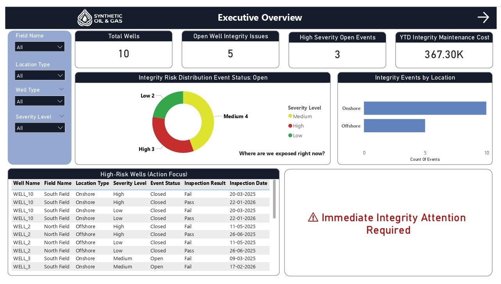
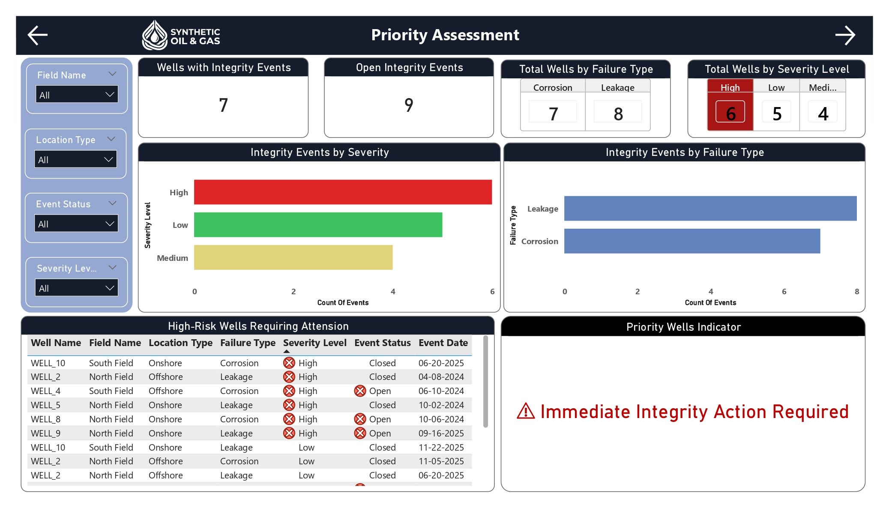
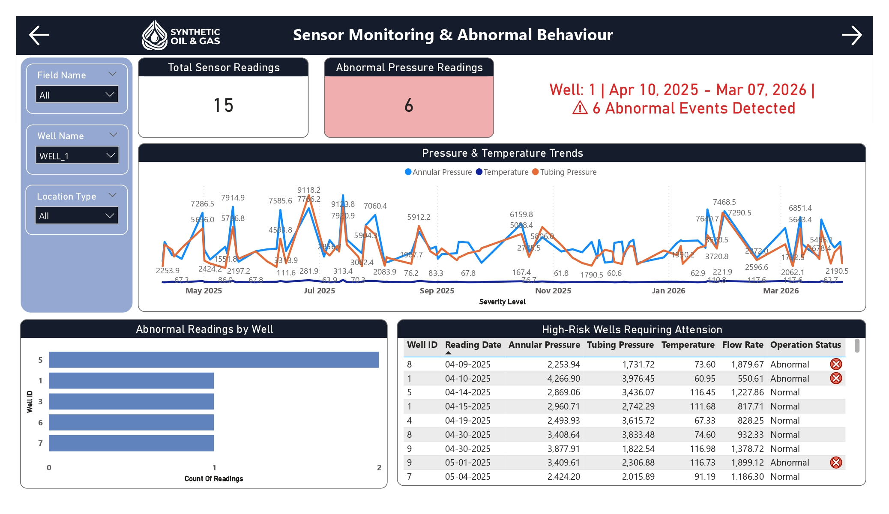
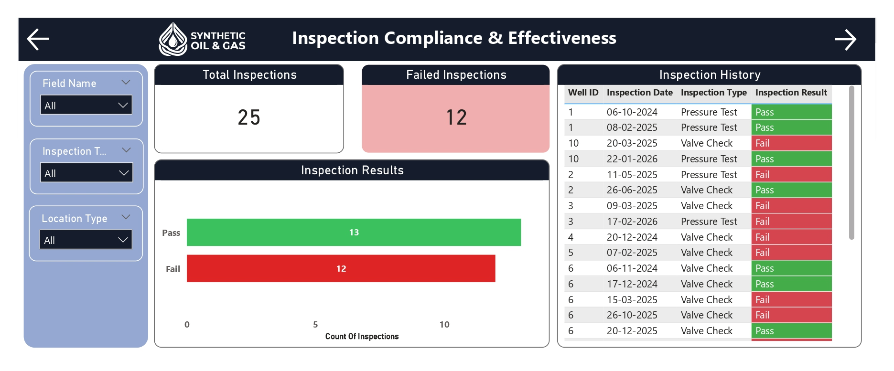
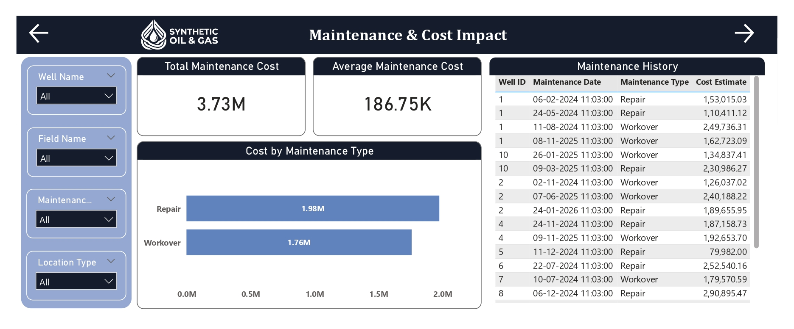
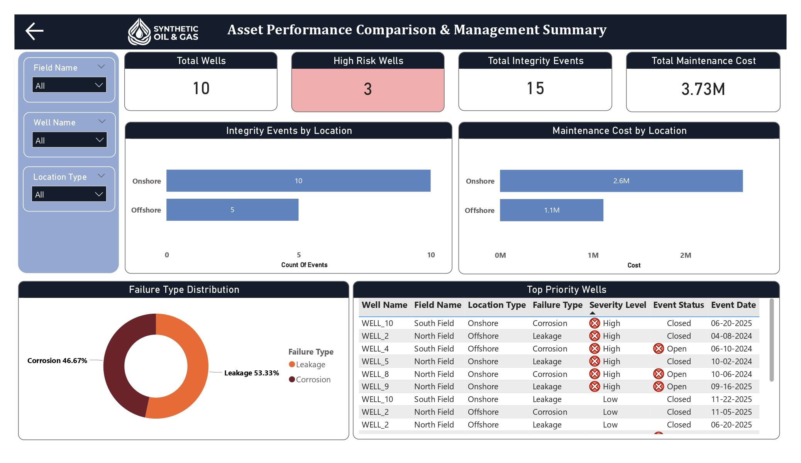

# Well Integrity Monitoring & Management System (WIMS)

## 📌 Project Overview
The **Well Integrity Monitoring & Management System (WIMS)** is an end-to-end data analytics project designed to support proactive monitoring, risk identification, and decision-making for **onshore and offshore oil & gas wells**.

The system integrates well master data, sensor readings, inspection records, integrity events, and maintenance history into a unified analytics platform, enabling teams to move from **reactive integrity response** to **risk-based proactive management**.

---
## 🔗 View Live Demo

👉 **[View Power BI Dashboard](https://app.powerbi.com/)**  

---

## 🎯 Business Problem
Oil & gas operators face significant:
- **Safety risks** from well integrity failures
- **Environmental risks** due to leaks and pressure loss
- **Financial impact** from unplanned maintenance and workovers

Integrity data is often fragmented across multiple systems, making it difficult to:
- Identify high-risk wells early
- Prioritize inspections and maintenance
- Understand cost exposure tied to integrity issues

---

## Project Objectives
- Design a **WIMS-style end-to-end analytics solution**
- Model realistic upstream integrity data using SQL
- Simulate **enterprise ETL logic** (ADF-style)
- Identify integrity risks using SQL analytics
- Surface insights through **decision-ready Power BI dashboards**

---

## Data Sources
Synthetic but industry-realistic datasets simulate real operational systems:
- **Well Master Data** – static well attributes (location, type, status)
- **Sensor Monitoring Systems** – pressure, temperature, flow (time-series)
- **Inspection Reports** – scheduled integrity inspections (pass/fail)
- **Integrity Events** – leakage, corrosion, severity, status
- **Maintenance & Workover Logs** – corrective actions and cost

All datasets are linked through a common `well_id`.

---

## Architecture & Data Modeling
- **Database:** SQL Server (relational)
- **Schema Type:** Fact Constellation (Galaxy Schema)

### Why Fact Constellation?
Well Integrity Management is **event-driven**, not purely transactional.

Different processes occur at different frequencies:
- Sensors → high-frequency time-series
- Inspections → periodic events
- Integrity failures → irregular incidents
- Maintenance → corrective actions

Each process is stored in its own fact table, all sharing the **Wells** dimension—mirroring how real WIMS platforms are used by integrity teams.

---

## ETL & Data Ingestion (Conceptual)
Enterprise-style ETL logic was designed to simulate Azure Data Factory behavior:
- Historical load followed by incremental inserts
- Parent-before-child load sequencing
- Referential integrity enforced using primary and foreign keys
- Validation via SQL joins and record counts

*Focus: ETL design and data consistency (tool-agnostic).* 

---

## Data Quality & Business Rules
**Quality controls:**
- Enforced foreign keys (no orphan records)
- Proper data types for all measurements
- Valid date formats
- Identity keys for uniqueness

**Business rules applied:**
- Valid operating pressure thresholds
- Abnormal sensor behavior detection
- Inspection failures and frequency checks
- Repeated integrity failure identification
- High-risk well classification

---

## Analytics & Risk Identification (SQL)
SQL analysis produced actionable insights:
- Wells operating outside pressure limits
- Repeated integrity failures
- Overdue or failed inspections
- Integrity risk levels by well
- Maintenance cost concentration

These outputs form the analytical backbone for reporting.

---

## 📈 Power BI Dashboard
A **six-page Power BI report** follows a six-layer dashboard design and a 16:9 layout. Each page serves a specific audience and decision level.

### Page 1 – Executive Overview

**Audience:** Asset Managers, Senior Leadership

**Purpose:** High-level integrity and cost snapshot

**Shows:**
- Total Wells
- Open Integrity Issues
- High-Severity Events
- YTD Maintenance Cost
- Risk distribution and high-risk wells

---

### Page 2 – Risk & Priority Assessment

**Audience:** Integrity & Asset Engineers

**Purpose:** Identify and prioritize high-risk wells

**Shows:**
- Integrity events by severity
- Failure types (leakage, corrosion)
- Wells requiring immediate action

---

### Page 3 – Sensor Monitoring & Abnormal Behaviour

**Audience:** Production & Surveillance Engineers

**Purpose:** Detect abnormal operating conditions early

**Shows:**
- Pressure & temperature trends
- Abnormal readings by well
- Operational status of sensor data

---

### Page 4 – Inspection Compliance & Effectiveness

**Audience:** Integrity & Compliance Teams

**Purpose:** Track inspection execution and failures

**Shows:**
- Pass vs Fail results
- Inspection history by well

---

### Page 5 – Maintenance & Cost Impact

**Audience:** Asset & Maintenance Managers

**Purpose:** Analyze integrity-related expenditure

**Shows:**
- Total & average maintenance cost
- Cost by maintenance type
- Maintenance history per well

---

### Page 6 – Asset Performance Comparison & Management Summary

**Audience:** Senior Management

**Purpose:** Strategic, decision-ready summary

**Shows:**
- Onshore vs Offshore risk comparison
- Maintenance cost by location
- Failure distribution
- Top priority wells

---

## Key Outcomes
- Identified **high-risk wells** requiring immediate attention
- Linked integrity risk to **inspection and maintenance gaps**
- Enabled **risk-based prioritization** over reactive response
- Delivered a **single, trusted integrity view** for technical and non-technical stakeholders

---

## Tools & Technologies
- **SQL Server** – data modeling and analytics
- **Power BI** – dashboards and visualization
- **Azure Data Factory (conceptual)** – ETL design
- **Excel / Python** – optional data preparation

---

## Role & Scope
**Role:** Data Analyst / Analytics Consultant

**Focus Areas:**
- Data modeling and ETL design
- SQL-based integrity analysis
- Business-driven dashboard design
- Translating operational data into decision-ready insights

---

## Notes
- Data used is synthetic but **industry-realistic
